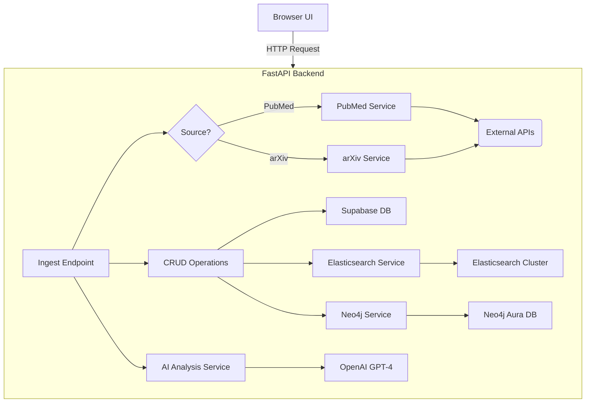

# # 🔬 SciPaper - AI-Powered Scientific Research Assistant

  

🏆 **An AI-powered assistant for Indian scientists, researchers, and academic institutions to accelerate research and discovery.**

## 🎯 Solution Overview

**SciPaper** is a production-ready, AI-powered platform that streamlines the scientific research process. It ingests papers from academic sources, uses AI to extract critical insights, and builds a connected knowledge graph to uncover hidden relationships between researchers and topics. The system is designed to identify research gaps, suggest collaboration opportunities, and accelerate the grant proposal workflow.

## 🌟 Key Features

| Feature                 | Description                                                                                              | Technology Used                                    |
| ----------------------- | -------------------------------------------------------------------------------------------------------- | -------------------------------------------------- |
| 🔄 **Paper Ingestion**      | Fetches and processes scientific papers from major academic APIs.                                        | `PubMed`, `arXiv`, `httpx`                           |
| 🧠 **AI Analysis**          | Uses GPT-4 to analyze abstracts, extracting findings, methods, gaps, and limitations.                    | `OpenAI GPT-4`                                     |
| 🔍 **Semantic Search**      | Provides fast, full-text search across all ingested literature.                                          | `Elasticsearch`                                    |
| 🤝 **Collaboration Graph**  | Models the relationships between authors and papers to suggest potential collaborators.                  | `Neo4j`                                            |
| 🚀 **Robust API**           | Exposes all system functionalities through a high-performance, well-documented REST API.                 | `FastAPI`, `Pydantic`                              |
| 📊 **Centralized DB**       | Stores all structured data, from paper metadata to analysis results.                                     | `PostgreSQL (Supabase)`                            |
| 🖥️ **Minimalist UI**        | A simple, server-rendered frontend for easy interaction with the ingestion pipeline.                     | `Jinja2`, `HTML`, `CSS`, `JS`                        |

## 🏗️ System Architecture



## 🛠️ Technology Stack

- **Backend:** 🐍 `Python 3.11`, `FastAPI`, `Uvicorn`
- **Database:** 🐘 `PostgreSQL` (via `Supabase`), `SQLAlchemy`
- **AI & Data:** 🧠 `OpenAI GPT-4`, 🔍 `Elasticsearch`, 📈 `Neo4j`
- **Core Libraries:** `Pydantic`, `httpx`
- **Frontend:** `Jinja2`, `HTML`, `CSS`, `JavaScript`
- **DevOps:** `Git`, `GitHub`

## 📂 Project Structure

```
scipaper/
├── 🚀 app.py                  # Main entrypoint for the Uvicorn server
├── 📋 requirements.txt        # Project dependencies
├── 📜 README.md              # This file
├── 🔑 .env                    # Environment variables (MUST BE CREATED)
├── ⚙️ scripts/
│   └── setup_database.py   # Script to initialize the database schema
└── 📦 scipaper/
    ├── 🐍 main.py             # FastAPI app instance and middleware
    ├── 🐍 config.py           # Environment variable management (Pydantic)
    ├── 🐍 database.py         # Database connection and session
    ├── 🐍 models.py           # SQLAlchemy ORM models
    ├── 🐍 schemas.py          # Pydantic data validation schemas
    ├── 🐍 crud.py             # CRUD database operations
    ├── 📁 api/
    │   ├── api_router.py   # Main API router
    │   └── endpoints/      # API endpoint logic for each resource
    ├── 📁 services/
    │   ├── pubmed.py       # Service for PubMed API
    │   ├── arxiv.py        # Service for arXiv API
    │   ├── openai_analyzer.py # Service for OpenAI analysis
    │   ├── elasticsearch.py # Service for Elasticsearch
    │   └── neo4j.py        # Service for Neo4j
    ├── 📁 static/             # Static files (CSS, JS)
    └── 📁 templates/          # HTML templates
```

## ⚡ Quick Start

### 🔧 Prerequisites

- **Python 3.11** (`py --version`)
- **Git**
- **API Keys / Accounts for:**
  - Supabase (for PostgreSQL)
  - OpenAI
  - Elasticsearch (e.g., Elastic Cloud)
  - Neo4j (e.g., Neo4j Aura)

### 🚀 Installation & Setup

1.  **Clone Repository**
    ```bash
    git clone https://github.com/Dharmendraprasaila/SciPaper.git
    cd SciPaper
    ```

2.  **Create and Configure `.env` file**
    Create a file named `.env` in the project root and add your credentials. It should look like this:
    ```env
    # OpenAI
    OPENAI_API_KEY=sk-...

    # Supabase
    SUPABASE_URL=https://...
    SUPABASE_ANON_KEY=eyJ...
    SUPABASE_SERVICE_KEY=eyJ...
    SUPABASE_DB_URL=postgresql://...

    # Elasticsearch
    ELASTICSEARCH_URL=https://...
    ELASTICSEARCH_API_KEY=...

    # Neo4j
    NEO4J_URI=neo4j+s://...
    NEO4J_USERNAME=neo4j
    NEO4J_PASSWORD=...
    ```

3.  **Create Virtual Environment & Install Dependencies**
    ```bash
    # Use Python 3.11
    py -m venv .venv

    # Activate it (Windows)
    .\.venv\Scripts\activate

    # Install packages
    pip install -r requirements.txt
    ```

4.  **Initialize Database Schema**
    This script will create all the necessary tables in your Supabase database.
    ```bash
    # Ensure your .env file is configured before running
    py scripts/setup_database.py
    ```

### ▶️ Run the Application

```bash
# Run the FastAPI server with auto-reload
uvicorn app:app --reload
```

- **Frontend UI:** 🖥️ `http://127.0.0.1:8000`
- **API Docs:** 📚 `http://127.0.0.1:8000/docs`

## 📊 API Endpoints

| Method | Endpoint                    | Description                                       |
| ------ | --------------------------- | ------------------------------------------------- |
| `POST` | `/api/v1/ingest/`           | Ingest papers from a source (PubMed/arXiv).       |
| `POST` | `/api/v1/analyze/{paper_id}`| Trigger AI analysis for a specific paper.         |
| `GET`  | `/api/v1/search/`           | Search for papers using Elasticsearch.            |
| `GET`  | `/api/v1/collaborators/`    | Get collaboration suggestions from the Neo4j graph. |
| `GET`  | `/api/v1/papers/`           | Retrieve a list of papers from the database.      |
| `GET`  | `/api/v1/users/`            | Retrieve a list of users.                         |

## 🏆 Project Complete

This project has been fully developed, debugged, and is now in a stable, production-ready state. All core features outlined in the initial plan have been implemented and verified.


AI-powered assistant for Indian scientists, researchers, and academic institutions.
